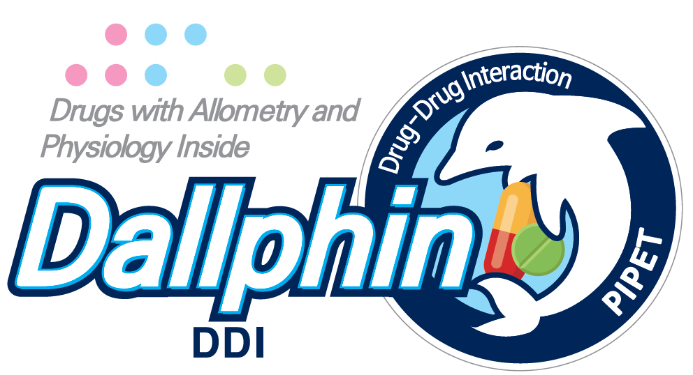

# Dallphin 

**Drugs with Allometry and Physiology Inside**

<!-- badges: start -->

<!-- badges: end -->

## Installation 

- [Download through Github Releases](https://github.com/pipetcpt/DallphinDDI/releases)

## Acknowledgement

*This research is part of the EDISON (EDucation-research Integration through Simulation On the Net) Program of the National Research Foundation of Korea (NRF) funded by the Ministry of Education, Science and Technology (grant number: 2016M3C1A6936614).*

---

Copyright©2019, All Rights Reserved by Pharmacometrics Institute for Practical Education and Training(PIPET), the Catholic University of Korea.
Reproduction and distribution of the scripts without written permission of PIPET is prohibited.
